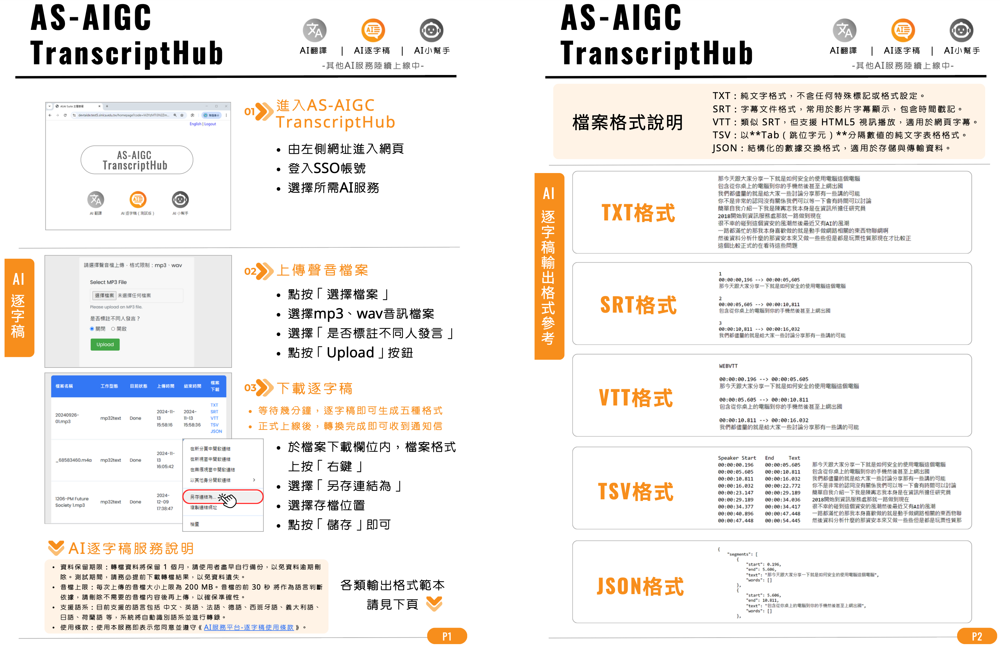

# fork TranscriptHub 試用
#### 調整程式讓他可以執行
#### 調整sql init順序等等


# 運行裝置
CPU i7-7700K<br>
ram 32G<br>
GPU 1080 8G<br>


[](https://www.sinica.edu.tw)
[](https://opensource.org/licenses/MIT)
[](https://reactjs.org/)
[](https://nodejs.org/)
[](https://golang.org/)
[](https://github.com/m-bain/whisperX)



一個 AI 語音轉錄平台，採用 React + Go 作為前端技術，並以 Node.js 作為後端基礎，提供高品質的語音轉錄服務。

An AI audio transcription platform built with React + Go for the frontend and Node.js for the backend, providing high-quality transcription services.

---

## 📋 目錄 | Contents
- [✨ 特色功能 | Key Features](#-特色功能--key-features)
- [🏗 系統架構 | Architecture](#-系統架構--architecture)
- [📁 專案結構 | Project Structure](#-專案結構--project-structure)
- [🚀 快速開始 | Quick Start](#-快速開始--quick-start)
- [📄 授權條款 | License](#-授權條款--license)

---

## ✨ 特色功能 | Key Features

### 🎨 前端應用 (apps/frontend/) | Frontend (apps/frontend/)
#### React 應用 | React Application
- 使用 HTML + CSS 簡單化的前端介面
  Simplified front-end interface using HTML + CSS
- 響應式 Material-UI 設計  
  Responsive Material-UI design.
- 即時任務進度追蹤  
  Real-time task progress tracking.
- 互動式轉錄檢視器  
  Interactive transcript viewer.
- 拖放式檔案上傳  
  Drag-and-drop file upload.

### 🛠 後端服務 (apps/backend/) | Backend Service (apps/backend/)
- WhisperX AI 轉錄引擎  
  WhisperX AI transcription engine.
- Node.js cluster 多核心處理  
  Multi-core processing with Node.js cluster.
- HTTPS 安全連線  
  HTTPS secure connections.
- TASK 排程管理  
  Task scheduling management.
- 可自定義多種 TASK  
  Customizable task types.
- 多種音訊格式支援  
  Support for multiple audio formats.
- 多種輸出格式支援  
  Support for multiple output formats.

---

## 🏗 系統架構 | Architecture
```
前端 (React + Go) ←→ API 閘道器 ←→ 後端服務 (Node.js)
    ↓                  ↓               ↓
UI 元件           負載平衡         工作程序
    ↓                  ↓               ↓
Go 檔案處理      API 路由         任務處理
    ↓                  ↓               ↓
Material-UI      認證服務        SQL 資料庫

Frontend (React + Go) ←→ API Gateway ←→ Backend (Node.js)
       ↓                    ↓                ↓
  UI Components        Load Balancer     Worker Processes
       ↓                    ↓                ↓
  Go File Handler      API Routes        Task Processing
       ↓                    ↓                ↓
   Material-UI        Auth Service      SQL Database
```

---

## 📁 專案結構 | Project Structure
```
TranscriptHub/
├── apps/
│   ├── frontend/                  # 前端應用目錄 | Frontend Application Directory
│   │   ├── Dockerfile             # Docker 配置 | Docker configuration
│   │   ├── www/                   # 靜態資源與模板 | Static assets and templates
│   │   ├── tmp/                   # 臨時檔案目錄 | Temporary files directory
│   │   ├── server.go              # 伺服器主程式 | Server main program
│   │   ├── router.go              # 路由處理 | Routing handler
│   │   └── ...                    # 其他前端檔案 | Other frontend files
│   └── backend/                   # 後端服務目錄 | Backend Service Directory
│       ├── controller/            # API 控制器 | API controllers
│       ├── services/              # 服務層 | Services layer
│       ├── sql/                   # SQL 腳本 | SQL scripts
│       ├── scripts/               # 轉錄腳本 | Transcription scripts
│       ├── transcribe/            # 轉錄輸出 | Transcription outputs
│       ├── upload/                # 檔案上傳目錄 | Upload directory
│       ├── main.js                # 應用程式入口 | Entry point
│       └── ...                    # 其他後端檔案 | Other backend files
│── doc/                           # 文件目錄 | Documentation directory
└── image/                         # 圖片目錄 | Image directory
```

---

## 🚀 快速開始 | Quick Start

### 前端設定 | Frontend Setup
詳見 [前端說明文件](apps/frontend/README.md)  
See [Frontend Documentation](apps/frontend/README.md)

### 後端設定 | Backend Setup
詳見 [後端說明文件](apps/backend/README.md)  
See [Backend Documentation](apps/backend/README.md)

---

## 📄 授權條款 | License
本專案採用 MIT 授權條款，詳見 [LICENSE](LICENSE) 檔案。  
This project is licensed under the MIT License. See [LICENSE](LICENSE) for details.
